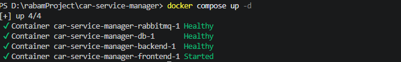

# Car Service Manager

A small web application for a car service shop to manage cars and their services (oil changes, inspections, etc.), built as a technical case study for RABAM.

## Tech Stack

- **Backend:** Java 25, Spring Boot 3.3.4, Spring Data JPA, MySQL 8, RabbitMQ
- **Frontend:** React 18, TypeScript, Vite, Axios
- **DevOps:** Docker, Docker Compose
- **Testing:** JUnit 5, Mockito, AssertJ, H2 (in-memory, MySQL compatibility mode)

## How to Run

Requires Docker Desktop.

```bash
docker compose up --build
```


This brings up MySQL, RabbitMQ, the backend, and the frontend, in the correct order, using healthchecks so each service only starts once its dependency is actually ready (not just started).

- Frontend: `http://localhost:3000`
- Backend API: `http://localhost:8080`

Verify the backend is up:

```bash
curl http://localhost:8080/actuator/health
```

Config (DB credentials, ports, RabbitMQ credentials, API base URL) is driven entirely by environment variables — see `.env.example`. Copy it to `.env` and adjust if needed; docker-compose reads it automatically.

## How to Run Tests

```bash
mvn test
```

Tests run against an in-memory H2 database (MySQL compatibility mode), so no Docker containers are required to run the test suite.

## API Overview

| Method | Endpoint | Description |
|---|---|---|
| GET | `/api/cars` | Paginated list of cars |
| POST | `/api/cars` | Create a car |
| PUT | `/api/cars/{id}` | Update a car |
| GET | `/api/services?carId=&status=` | Paginated list, optional filters |
| POST | `/api/services` | Create a service for a car |
| PUT | `/api/services/{id}` | Partial update: title, description, and/or status |

License plate format: 2-5 uppercase alphanumeric characters per segment, with up to two optional `-` or space separated segments (e.g. `34ABC123`, `34-ABC-123`). Chosen to be generic rather than modeling one specific country's exact rules.

## State Machine

Service status transitions are validated in a single place (`ServiceManager`), not scattered across the codebase. Valid transitions: `PENDING → IN_PROGRESS → DONE`, forward only. No skipping, no going backward, no re-entering the same state. Adding a new status later only requires updating this one class. The frontend's status dropdown only ever offers the valid next state(s) for the current status, so an invalid transition can't even be attempted through the UI.

## Concurrency Safety

**Optimistic locking (Requirement 4):** `Service` has a `@Version` field. If two clients load the same service and both submit updates, the second `save()` fails with `ObjectOptimisticLockingFailureException`, which `GlobalExceptionHandler` maps to `409 Conflict`. Proven by `OptimisticLockingConcurrencyTest`, which loads the same row into two separate copies, saves one, and asserts the second is rejected.

**Max 2 active services per car (Requirement 5):** Before transitioning a service to `IN_PROGRESS`, the request first acquires a pessimistic write lock on the parent `Car` row (`SELECT ... FOR UPDATE`, via `CarRepository.findByIdForUpdate`) inside the same transaction. This serializes any concurrent requests trying to activate a service for the *same* car — the second request blocks until the first transaction commits, so the active-count check it then performs always reflects an up-to-date count instead of racing with an in-flight transaction. Proven by `MaxActiveServicesRaceConditionTest`, which fires two concurrent activation attempts at the same car via `ExecutorService` + `CountDownLatch` and asserts exactly one succeeds and the final count never exceeds 2. Also manually verified through the actual UI.

**Duplicate license plate (Requirement 2b):** Checked at the service layer for a fast, clear error message, and backed by a DB-level unique constraint as the real source of truth — `saveAndFlush` surfaces a constraint violation inside the same request instead of at a later, uncontrolled point, and it's translated into a `409` with a clear message.

## Frontend

- **Car list:** table view, create form with real backend error messages (duplicate plate, invalid format) instead of a generic error.
- **Service list:** filterable by car and/or status, with inline title/description editing.
- **Status updates:** dropdown restricted to valid next states per the state machine.
- **Error handling:** failed updates (max-active-services, invalid transition, optimistic lock conflicts) show the actual backend message and refresh the row instead of failing silently.

## Assumptions & Trade-offs

- Chose MySQL over H2 for the runtime database (per the "H2 or MySQL" option in the spec) since it's closer to a real production setup; H2 is used only for fast, container-free tests.
- License plate format is intentionally generic (not modeling a specific country) since the spec allows this.
- Used `@RestControllerAdvice` for centralized error handling rather than per-controller try/catch, so every endpoint returns errors in the same shape.
- Used a pessimistic lock (`SELECT ... FOR UPDATE`) rather than a DB-level constraint (e.g. a partial unique index) for the max-2-active rule, since the rule is a *count* threshold rather than a simple uniqueness rule, which doesn't map cleanly onto a unique constraint.
- Frontend uses plain component state (no Redux/React Query) given the app's small scope; each list re-fetches on a simple trigger counter rather than a caching layer.